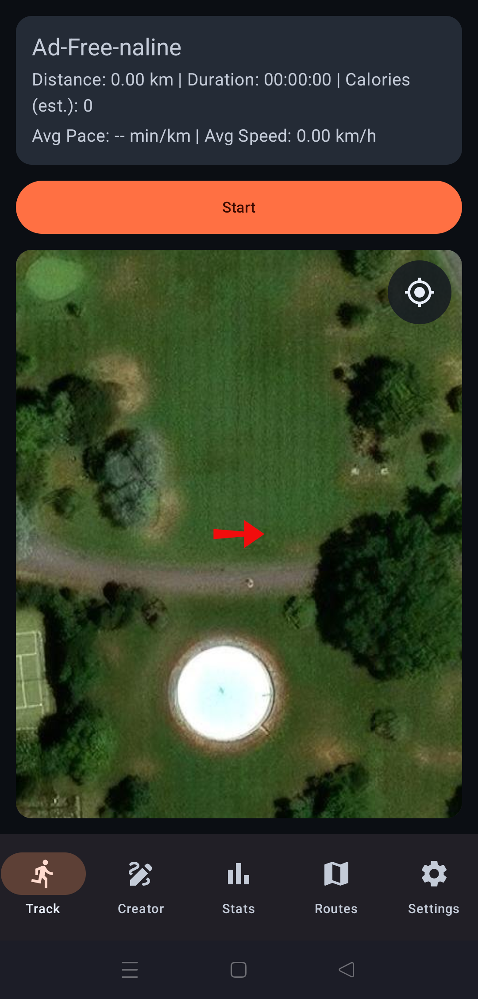
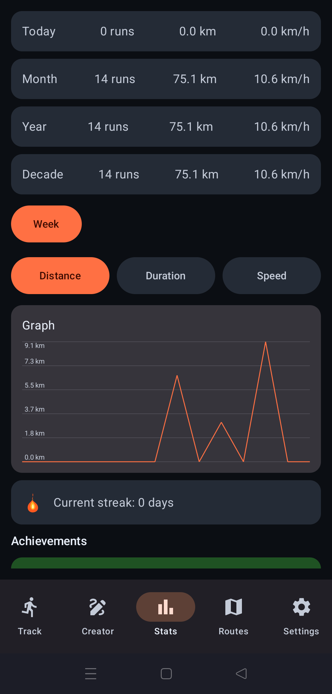
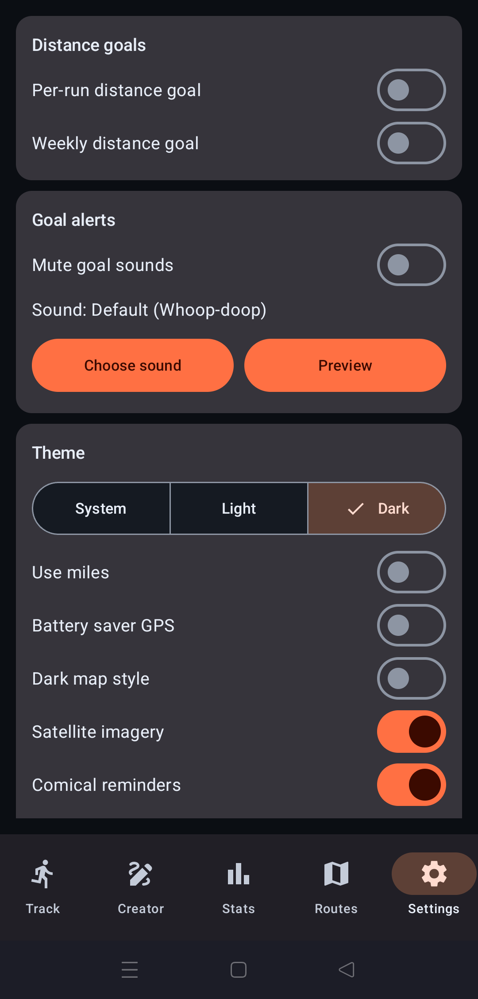

# Ad-Free-naline

[](https://github.com/luckiermandel/AdFreeNaline/actions/workflows/ci.yml)
[](LICENSE)

A local-first Android run tracker built with Kotlin and Jetpack Compose. GPS tracks your runs, history stays on device, and maps use free tile sources (no API keys, no ads).

**Package:** `com.luckierdev.adfreenaline`  
**Min SDK:** 26 (Android 8.0)

## Screenshots

| Track | Stats | Settings |
|-------|-------|----------|
|  |  |  |

## Features

### Run tracking
- Start, pause, resume, and finish runs
- Live distance, duration, average pace/speed, and estimated calories
- Red live route polyline on the map
- Foreground service with an ongoing notification while a run is active (distance, speed, calories)
- GPS noise filter (segments below ~0.5 km/h are ignored)
- Runs shorter than **50 m** are discarded on finish
- Active run auto-resumes after app restart (within 24 hours), including pause state

### Maps
- **MapLibre** vector maps via [OpenFreeMap](https://openfreemap.org) (OpenStreetMap-based data)
- Optional **dark map style**
- Optional **Esri World Imagery** satellite overlay
- No Google Maps SDK and no map API keys required
- Map attributions and license links in **Settings → Data & licenses**

### Route creator
- Tap the map to place waypoints and build custom routes
- Save, edit, categorize, apply, and delete routes
- Configurable creator route color

### Stats & history
- **Stats** tab: summary cards, time-window graphs (day/week/month/year/all), run streak counter, and unlockable achievements
- Grouped run history (today, last week, older)
- Country code recorded per finished run (via reverse geocoding when available)

### Goals & alerts
- Per-run and weekly distance goals (km or mi)
- In-app progress while tracking
- Optional sound/vibration alerts when a goal is reached (custom notification sound supported)

### Settings
- Theme: follow system, light, or dark; km/mi; battery-saver GPS mode
- Health profile: sex, age, height, weight (used for calorie estimates)
- Calorie goal per run
- Optional daily streak reminders (three humorous notifications per day)
- Export run history to CSV
- Delete all app data (full reset)

### Onboarding
- First-launch profile setup (sex, age, height) with explanation of why it is collected; can be skipped

## Calorie estimates

Calories burned are **estimates only**. The app uses a MET-based formula adjusted by your profile (sex, age, weight), pace, and duration. They are not medical or dietary advice and may differ from actual energy expenditure. The app shows this disclaimer during onboarding and in Settings.

## Tech stack

| Area | Libraries |
|------|-----------|
| UI | Jetpack Compose, Material 3, core-splashscreen |
| Architecture | ViewModel, Kotlin coroutines, StateFlow |
| Location | Android `LocationManager` via `LocationManagerCompat` (no Google Play Services) |
| Maps | MapLibre GL (`android-sdk-opengl`), OpenFreeMap styles, optional Esri raster tiles |
| Persistence | Room (runs, routes, settings, active session) |
| Utilities | osmdroid `GeoPoint` only (not used for map rendering) |

Dependency versions live in the Gradle version catalog at [gradle/libs.versions.toml](gradle/libs.versions.toml). Room schemas are exported to `app/schemas/` and checked in so migrations can be validated.

Legacy `SharedPreferences` data is migrated into Room on first launch after upgrade.

## Permissions

- **Location** (fine + coarse) — GPS tracking and map centering
- **Notifications** (Android 13+) — live run updates and goal alerts
- **Foreground service (location)** — keep tracking while the screen is off or another app is in front

The app does **not** request background location access; tracking relies on a foreground service while a run is active.

## Build & run

### Android Studio
1. Open the `RunTrackerApp` folder in Android Studio.
2. Sync Gradle.
3. Run on a device or emulator with GPS (or mocked location).
4. Grant location and notification permissions when prompted.

### Command line
```bash
./gradlew assembleDebug          # debug APK
./gradlew test                   # unit tests
./gradlew connectedAndroidTest   # instrumented tests (device/emulator required)
```

Debug APK output: `app/build/outputs/apk/debug/app-debug.apk`

Release APKs use signing credentials outside the repo. Copy `signing.properties.example` to `~/.config/adfreenaline/signing.properties`, create a keystore, then run `./gradlew assembleRelease`. F-Droid builds and signs on their own servers, so local signing is only needed for distributing APKs yourself.

### Continuous integration

GitHub Actions runs unit tests, Android lint, and a debug build on every push and pull request ([.github/workflows/ci.yml](.github/workflows/ci.yml)).

## Tests

Unit tests cover calorie math, CSV export, entity mapping, map tile URLs, achievements/streak logic, goal-distance formatting, and run-session policies (50 m discard, 24 h restore). Instrumented tests cover Room DAOs, legacy prefs migration, and a basic launch smoke test.

## Data & privacy

- All run history, routes, and settings are stored locally in SQLite via Room (`adfreenaline.db`).
- No user accounts, cloud sync, or analytics in the current app.
- Android backup is disabled (`allowBackup=false`).
- Privacy policy: [PRIVACY_POLICY.txt](PRIVACY_POLICY.txt)

## Roadmap (not implemented yet)

- Custom challenges UI (schema exists in Room; no screen yet)
- Social feed, segments, accounts, and cloud sync
- Map matching and advanced pace smoothing
